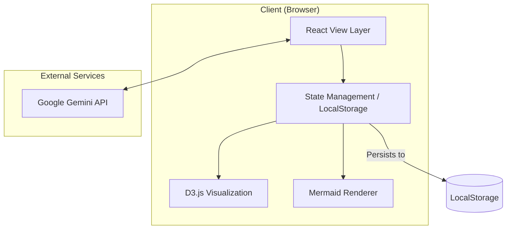
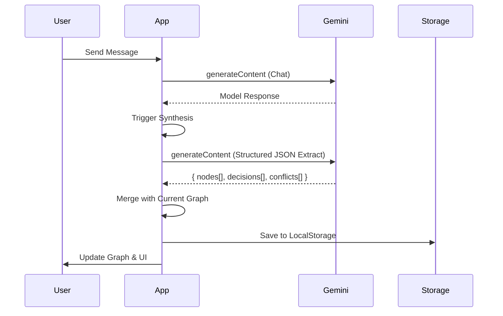

# System Design - R&D Architecture Assistant

## 1. Overview
The R&D Architecture Assistant is a client-side web application built with React, Vite, and TypeScript. It leverages the Google Gemini API (Flash/Pro) for natural language processing, architectural synthesis, and documentation generation.

## 2. High-Level Architecture

### 2.1 Component Responsibilities
- **`App.tsx` (Orchestrator):** Manages global state, model selection, project lifecycle, and API interaction.
- **`KnowledgeGraph.tsx` (Visualizer):** Implements D3.js force-simulation to render the architectural map.
- **`Mermaid.tsx` (Diagrammer):** Provides isolated rendering and zoom capabilities for Mermaid-based diagrams.

## 3. Core Logic: Synthesis Flow
The "Synthesis" flow is the core of the application, transforming unstructured chat history into structured architectural data.

## 4. State Management Lifecycle
- **Initialization:** On load, the system retrieves projects from `localStorage`. If empty, it initializes a "Default Project".
- **Real-time Updates:** React `useState` hooks manage immediate UI updates (chat messages, node selections).
- **Periodic Sync:** The `useEffect` hooks monitor state changes and persist the entire `projects` array back to `localStorage`.
- **Project Context:** `currentProjectId` determines the active subset of state (messages, graph, tradeoffs) being rendered.

## 5. Technology Nuances
- **D3 force-simulation:** Uses a custom clustering force to group nodes by `KnowledgeLayer` (Infrastructure, Data, Logic, etc.).
- **Mermaid rendering:** Employs `mermaid.render` to generate SVG strings on the fly, which are then integrated into the React DOM.
- **Gemini SDK:** Uses `callGeminiWithRetry` to handle transient network errors and API quota exhaustion with exponential backoff.

